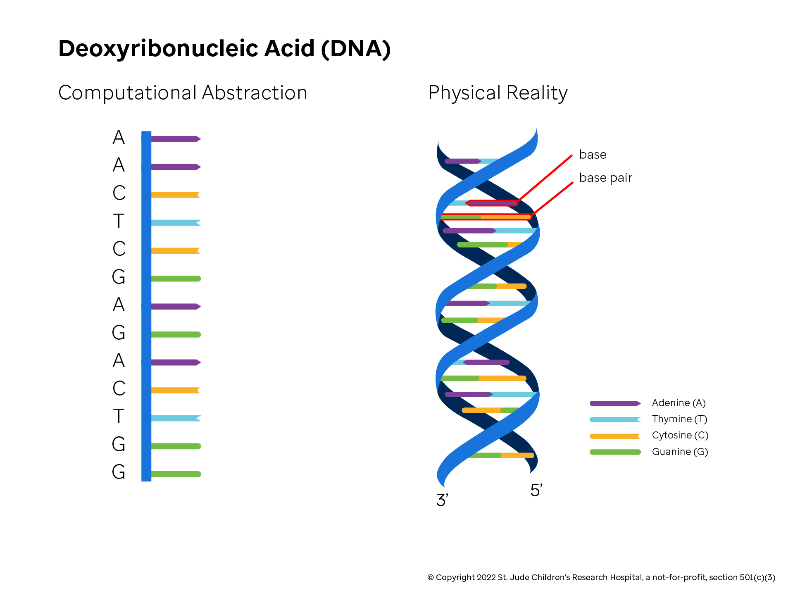

## Introduction

**Cells** are the smallest unit of life and are the building blocks of organisms, from a single-celled bacteria to the [trillions of cells that make up the human body](https://journals.plos.org/plosbiology/article?id=10.1371/journal.pbio.1002533). Cells are complicated organized structures that take a variety of forms, forming tissues and organs and completing the body's functions.

Within nearly every cell is a **genome**. A genome is the complete inherited instruction set for producing, operating and maintaining a living cell or organism. This information is physically encoded in a molecule called deoxyribonucleic acid or **DNA**. Among other things, DNA contains instructions for the assembly of tens of thousands of different molecular products. These instructions (or recipes) are called **genes**, and the physical, molecular products genes encode for are called **proteins**. Cells are constantly reading and interpreting the DNA code of genes in order to assemble various proteins. Each cell type in the body produces a complex ecosystem of proteins that keep the cell alive and executing its specific function.

### Bakery Analogy

To illustrate this phenomenon, imagine the cell as a bakery that makes many different types of cakes. In this analogy, the genome stored within the DNA is the master recipe book containing more than 20,000 different cake recipes (genes). The physical cakes that are made from these recipes are the proteins. Notably, you may have limited numbers of the gene (generally two copies in the case of humans), but you may make thousands or more cakes from those two recipes that are written down. Depending on the type of cell, the mixture of different cake flavors, their quantities, and how they interact together will be different.

Keep an eye on this analogy: we will refer back to and build upon it a number of times during the course of this guide.

## A Mental Model for DNA 

Conceptually, you can think of DNA laid end-to-end as a ~3 billion character long string consisting only of 'A's, 'C's, 'T's and 'G's. This string and any substring contained within are commonly referred to as genomic **sequences**. These characters represent the physical Adenine, Guanine, Thymine, and Cytosine **bases** (or **nucleotides**) respectively. Importantly, though it's easy to conceptualize DNA as a single, very long string, the reality is more complex. DNA is comprised of two complementary sequences known as **strands**. Each base is actually a member of a **base pairs**, whereby nucleotides complement each other uniquely—'A's pair only with 'T's, and 'G's only with 'C's. Up close, this structure resembles a spiral staircase as seen in the figure below.

When cells divide, the spiral unwinds; each base pair is split; and the molecule is split into two strands, each one containing the information needed to replicate the original DNA structure. Normal healthy cells then copy the genetic code very accurately, rarely introducing variation.

### Physical Structure

In plants and animals, DNA is broken up into a number of large sequences called **chromosomes** which are paired and tucked into the nucleus. Each chromosome is composed of two DNA molecules (one from your father and one from your mother) and packaging proteins, or **histones**, that keep the DNA string neatly wound and help control which gene products are made in a given cell. For humans, there are normally 22 **autosomes** (chromosomes shared by both sexes) and pair of sex chromosomes (XX for females or XY for males). Autosomes are numbered from 1 to 22 based on size, arranged from largest to smallest. The full set of chromosomes makes up the genome.

## Conclusion

The genome is a vast search space for biological questions. Each genome is a biochemical database that, if properly accessed, can inform how our bodies function. Genomes account for the natural differences between individuals, define family traits, and distinguish how cells in tissues and organs vary. When genomes acquire adverse mutation(s), cancer as well as other genetic diseases can occur. By examining the relationship between physical traits (e.g. blood pressure or the development of a tumor) and the genome, known as **genotype-phenotype relationships**, clinicians can develop personalized medical treatment based on an individual's genetic makeup.
