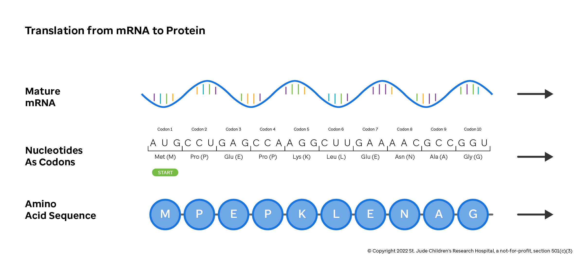
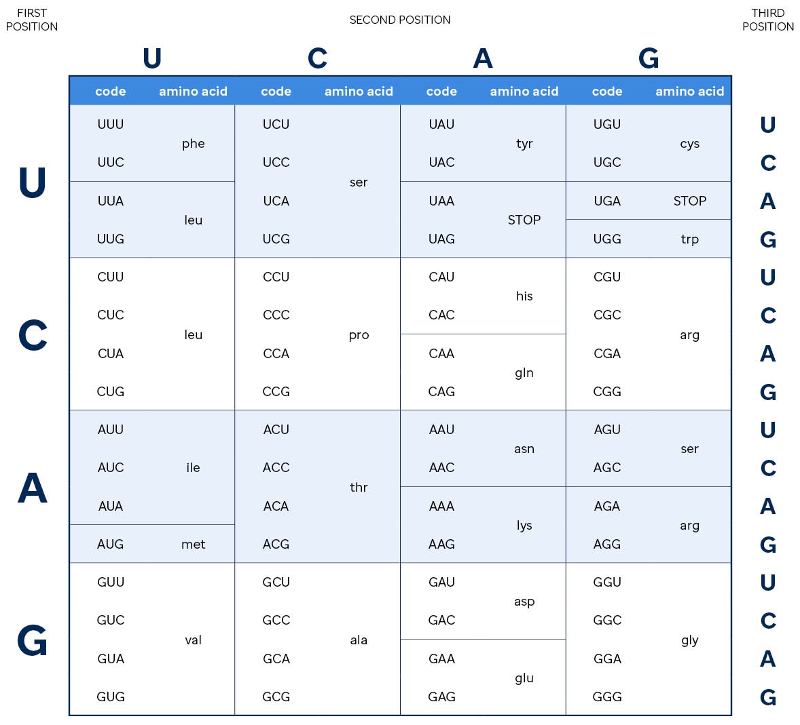
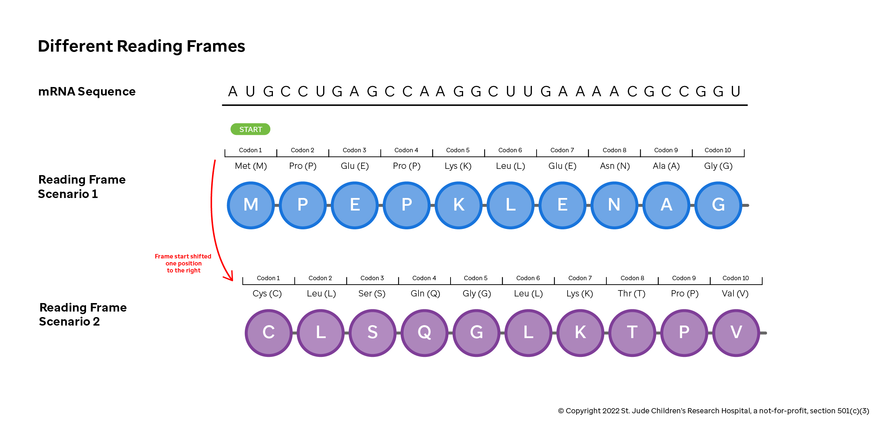

# Translation

## Decoding the Transcript

After DNA is transcribed to RNA and the RNA is spliced, the next step in protein
production is translation. The genetic code that cells use to translate RNA to protein
is universally preserved across organisms. So you, your dog, and the lettuce in your
salad all read and translate the genetic code the same. This helps scientists determine
which changes in a gene have functional consequences by comparing transcripts from
different species. Further, the universality of this code makes modeling genetic
diseases in animals—such as grafting cancer onto a mouse, known as a 
**xenograft**—informative.

The mRNA transcript is encoded in three-letter nucleotide blocks known as **codons**.
Codons specify that a particular protein building block, or **amino acid**, should be
added to a growing protein chain. For example, the mRNA sequence above has "CCU" in the
second codon position. This codon instructs the protein assembling machinery of the cell
to a Proline to the amino acid sequence at position two. 

As shown in the amino acid lookup table above, other codons specify that translation
should start or end at a particular spot. Because multiple triplets result in the same
amino acid, some substitutions may not change which amino acid is added to the chain
(e.g., if your triplet starts with "CG", the amino acid is always an arginine and the
third nucleotide doesn't matter). This class of variation, where the mRNA sequence change
but the amino acid sequence stays the same, are called "silent mutations". When codon
variants change the amino acid, the effect ranges from insignificant to deleterious.
Computational biologists use programs that incorporate knowledge of the codons and
chemistry of proteins to predict the effect of a given variant.

As a short aside, DNA and RNA use different coding alphabets. That is, in a mRNA
transcript, the DNA base thymine (T) is substituted by uracil (U).

| **Molecule** | **Alphabet**                                                               |
| ------------ | -------------------------------------------------------------------------- |
| DNA          | ACGT                                                                       |
| RNA          | ACGU (Uracil replaces Thymine, i.e., U replaces T)                         |
| Proteins     | Uses a series of triplets in RNA (codons) to encode an amino acid sequence |

## Reading Frames

The accuracy of this process is dependent where you start. The three-letter code, and
the resulting protein, will be completely different if translation starts on the first,
second or third letter. For example, consider the sequence "AUGGCACGUUG". If translation
starts at the first base, the cell reads "AUG"s, "GCA" and "CGU"; and if you start at
the second base, the sequence would read "UGG", "CAC", and "GUU" . These options are
referred to as **reading frames**, where the functional or **open** reading frame is one
that begins with the start codon "AUG". Changes to the sequence that starts, stops or
moves a reading frame dramatically alters the protein product. For example, the first
read would produce met, ala and ala while the second would produce trp, his and val.
Mutations that change which blocks of three bases are used as codons are
called **frameshift** mutations.

