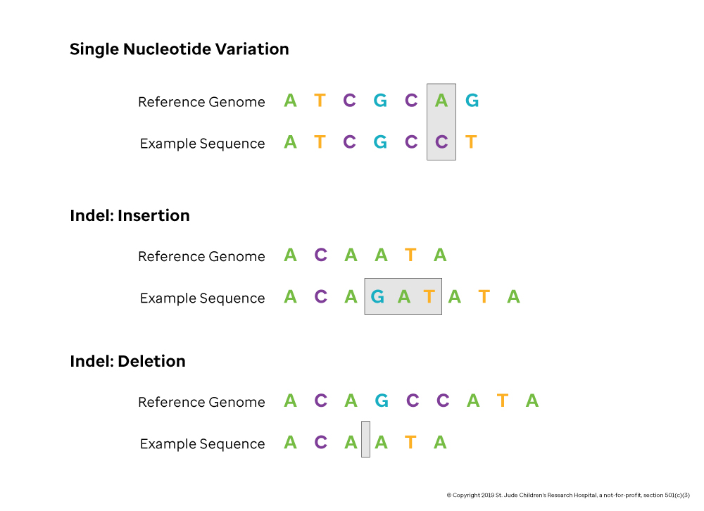

Any difference, large or small, between the sequence of the reference genome and an individual is considered a **variant.** Each human genome contains at least thousands of variants that are informative enough to identify a person, potential family members and many of their medical risks. Many variants are small, just one base, but some variants alter millions of bases and even whole chromosomes (e.g. an extra copy of chromosome 21 in individuals with Down Syndrome). Variation in the genome takes many forms, including, but not limited to: Single Nucleotide Variants (**SNVs**), Insertions and Deletions (**Indels**), Structural Variations (**SVs**), and Copy Number Variations (**CNVs**). An important part of computational genomics involves detecting, analyzing and interpreting the relevance of genomic variants to disease.

