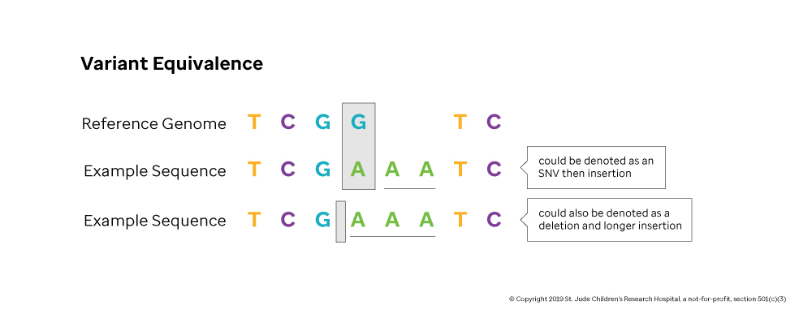

During the course of an organism's life, changes to its underlying genetic code will be introduced by a variety of processes. Many of these changes are harmless and are the underlying current driving a species' evolution. Rarely, variation within the genome or combinations thereof will cause adverse phenotypes in individuals that carry the variation(s) \[e.g. cancer\]. The replicate-and-branch nature of the cell lifecycle means that genetic code within different parts of one's body evolve separately and slowly diverge from on another. This phenomenon can be observed more starkly when considering the difference in genetic code from humans separated by large geographic regions.

Before one can detect mutations that have occurred in a particular individual's genome, there must be a baseline genome to compare against. As stated above, there underlying DNA in humans across the world varies greatly. Importantly, there exists no way to capture an "average" human's DNA to create the aforementioned baseline to compare against. Biologists across the world use a common **reference genome**, which is curated by the Genome Reference Consortium, as the foundation for calling variation in an individual**.** The reference genome is a combination of different individuals DNA collected during the Human Genome Project (and refined since that time).

One of the criticisms of this approach is the lack of accounting for the diversity amongst the world's populations. For example, [~70% of the material for the Human Genome Project came from an anonymous, white male from Buffalo, NY known only as RP11][rp11]. Using this linear, haploid reference genome to quantify variation across diverse populations is far from perfect, but the international genomics community has come up with several strategies for mitigating its negative effects (e.g. population frequency databases). Note that in the next version of the reference genome (hg39), the preferred approach appears to be a graph-based structure that can define variation in a much wider variety of populations.

_Note:_ The results of any genomic analysis depend the version and source of reference sequence—results generated from different versions of a reference genome typically cannot be compared.

## The Analysis of Tumors vs. Germline Mutations

Having a matched pair of tumor and germline data is especially valuable in variant detection because germline data acts as a precise control. The analyst uses the paring to sort out common but irrelevant SNVs found in the normal germline tissue from the new cancer driving mutations in the tumor.

Studies that consist only of tumor samples are useful in diagnosing subtypes of the disease. Cancer subtypes often differ in their rate of progression and require distinct treatments. Subtyping helps clinicians provide the precise course of treatment most suited for a given tumor.

Studies that consist only of germline samples are general useful for discovering genes and variations that are associated with disease. Germline studies are basic research studies where hundreds of thousands of candidate variations are systematically filtered to find a few significant variants. Disease associated variants could be markers for elevated risk or causative mutations that predispose the subject to disease.

### Variant Equivalence

A common problem in calling genomic variation is the multitude of ways a variation can be annotated. Two different variant callers might describe the same genomic alternations in two different ways. For example, consider the variation that occurs in Figure 3.4. Either notation captures the event correctly, but one considers there to be an SNV then insertion while the other considers the event a deletion and subsequent insertion. These differences make comparisons across data sets more difficult. To alleviate the problem, there are standards emerging that tools can adhere to an software to help normalize notation of variants, but the problem still exists.

[rp11]: https://www.theatlantic.com/science/archive/2018/11/human-genome-300-million-missing-letters-dna/576481/
