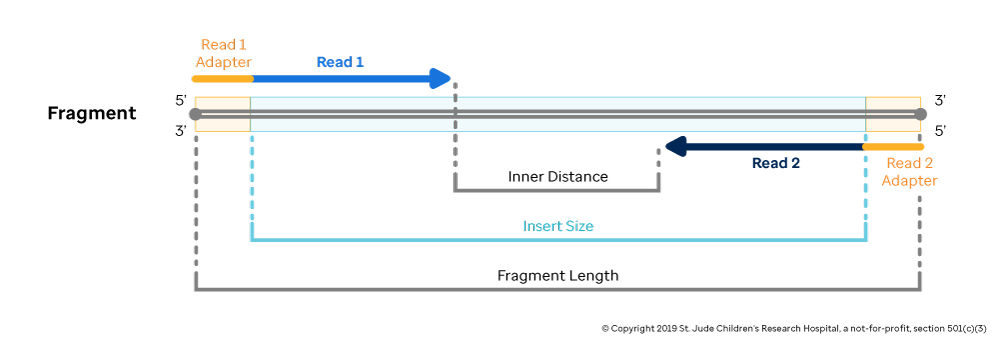
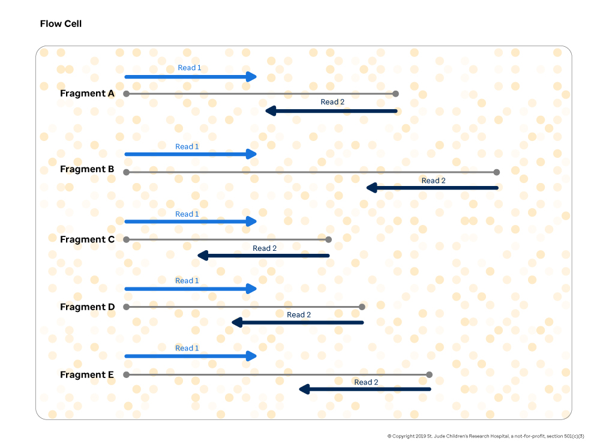
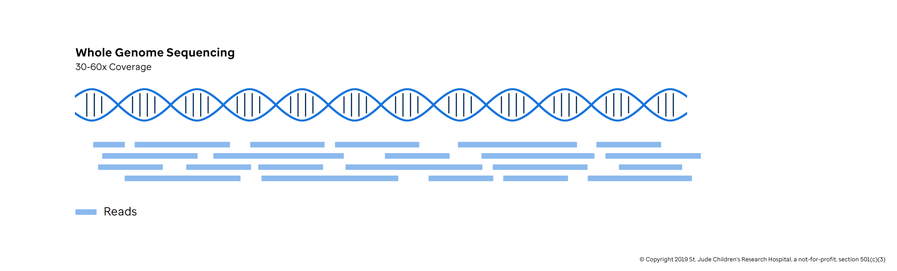
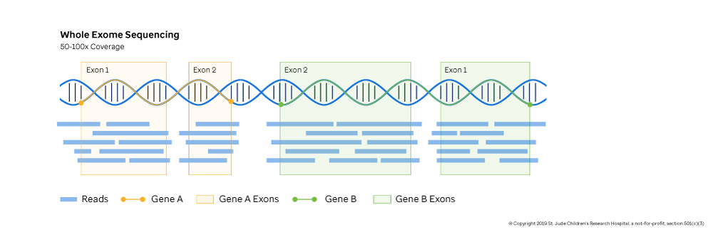
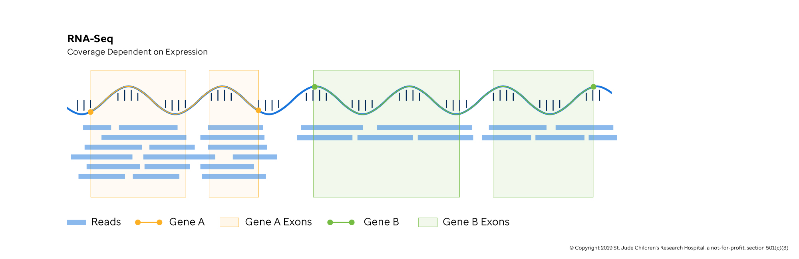
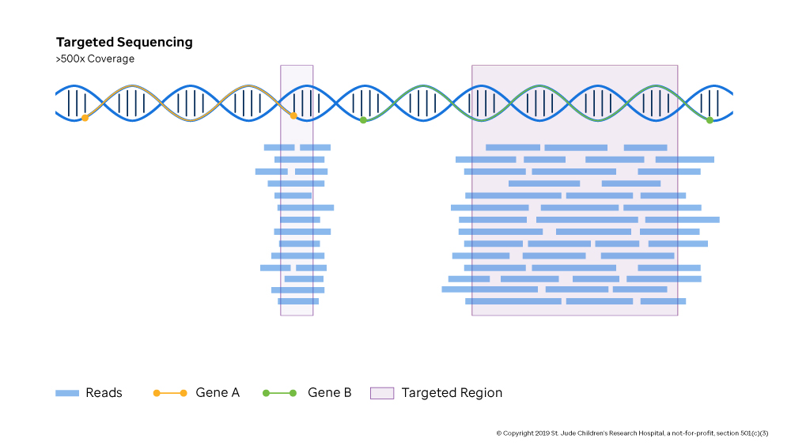

Once collected, sequencing the sample begins. The sample is removed from storage, and a portion is taken to prepare what is called a "library" for sequencing. This is always performed in a wet lab environment, and the chemical methods can be quite complex.

While it sounds easy to read the entire genome by laying all of the chromosomes end-to-end, in practice, there are some problems with this approach. Chiefly, researchers currently lack the biochemical processing abilities to extract to read such long stretches of DNA quickly and accurately. Additionally, next generation sequencing technologies have their own set of limitations, including:

- Each nucleotide the sequencer calls is accompanied by a confidence score estimating the how likely the recorded call is true. In short, the sequencer\'s calls are not perfect.

- As the sequencer observes each nucleotide along the read, the confidence it has in each new call drops so that if allowed to continue eventually the data quality of the last bases would be too low to use reliably.

- Sequencers can only read DNA fragments because RNA is too unstable. So biochemical methods are employed to reverse the transcription process and produce a DNA fragment that captures the information in the RNA sequence.

Given these physical limitations, the process, called **shotgun sequencing**, looks more like the following:

1.  The sample's DNA is fragmented into billions of smaller DNA pieces that are somewhere between tens to thousands of bases long.

2.  This soup of DNA fragments with randomly distributed lengths is then put through a filtering step called "size selection". Only DNA fragments of a certain length will remain (typically somewhere between 200-500 bp, where bp stands for base pair).

3.  Among many other important steps to prepare the DNA library for sequencing is "adapter ligation". This process involves tacking on special sequences to both ends of the DNA fragment which is required by the sequencing process.

4.  Optionally, a chemical amplification step can be conducted to increase the amount of genomic material available for sequencing.

5.  The sample is loaded onto a flow cell and put into an Illumina sequencer, which is capable of reading millions of DNA fragments and capturing the results digitally.

6.  Once the sequencing is complete, the sequencer closes the sequencing session by creating a directory of BCL files (Illumina\'s proprietary storage format). These are immediately converted to a FASTQ file (standard DNA storage format), typically the "input" to the computational team.

For our paired-end sequencing example, it is important to note how the DNA sequencer reads the data in step 4. In each 200-500bp DNA fragment, the sequencer begins reading from one of the fragments and drops off somewhere in the middle. It stores all of the nucleotides read from this end of the fragment with their associated confidence scores as "Read 1". After this is complete, the sequencer reads from the opposite end of the fragment and stores the nucleotide calls and confidence scores known as "Read 2". Together, the combination of a Read 1 from a DNA fragment and a Read 2 from the other end of the DNA fragment is called a "read pair" as denoted in Figure \#.

After the steps above have completed, the result is a single FASTQ file (single-end sequencing) or a pair of FASTQ files (paired-end). For more information on the FASTQ file format, see its section in the "Genomic File Formats" chapter.

## Types of Sequencing

Sequencing is laboratory technique that identifies and determines the order of bases in a DNA molecule. Each sequencing type is best analyzed by a different computational method and is interpreted in different way. The scientific goals of the research, cost and practical limits determine which types of sequencing are chosen. For example, clinical sequencing seeks the time-sensitive detection of known mutations, while population studies focus on the discovery of new variants. Often, the type of sequencing ordered is a trade-off between cost and the breadth of information. This section discusses what scientists weigh when deciding which pieces of the genome/exome/transcriptome needs sequencing; the "Data Acquisition" section of this guide focuses on how the genome/exome/transcriptome are sequenced.

## Common Sequence Applications

| **Area of the genome**   | **Abbreviations**          | **Description**                                                                                                                                                                              |
| ------------------------ | -------------------------- | -------------------------------------------------------------------------------------------------------------------------------------------------------------------------------------------- |
| Whole Genome Sequencing  | WGS                        | Characterizes the entire genome reading sequences from DNA                                                                                                                                   |
| Whole Exome Sequencing   | WES, WXS                   | Characterizes the exonic, or coding, regions of the genome reading sequences from DNA                                                                                                        |
| Transcriptome Sequencing | WTS, RNA-seq               | Characterizes the exonic regions that are actively expressed in the cell reading sequences from RNA                                                                                          |
| Targeted Sequencing      | Validation Capture, Valcap | Characterizes a chosen region from DNA, can be a coding or non-coding region. The region can be coding or non-coding and is typically focused, high-depth sequencing for validating variants |
| ChIP seq                 | ChIP-seq                   | Characterizes any sequence the genomic locations where a protein interacts with DNA, both coding and non-coding                                                                              |
| ATAC sequencing          | ATAC-seq                   | Characterizes any sequence where DNA does not interact with proteins or is "open", both coding and non-coding                                                                                |
| Hi-C                     | Hi-C                       | Characterizes the genomic locations where chromosomes come in close contact with each other. Typically used in characterizing 3D interactions of DNA                                         |
| Single Cell Sequencing   | scDNA-seq, scRNA-seq       | DNA or RNA sequencing of individual cells, captures granularity at an individual cell level rather than a mixture of cells, can be coding or non-coding with lower coverage                  |

## Whole Genome Sequencing

If cost was not an issue, whole genome sequencing (**WGS**) would be the standard approach for detecting variants. The advantage of WGS is a complete survey of the DNA, allowing the researcher to detect all the genomic variation for a given sample. WGS is needed when exploring how variations in non-coding regions influence the cells. Further, WGS is needed to detect the scope of variants that affect large regions of the chromosome (Structural Variation and Copy Number Variation, which are discussed in Chapter 3). The disadvantage, other than cost, is that many of variations are not relevant to disease or the research question and need to be carefully filtered out. WGS is used in basic exploratory research and increasingly in the clinic as costs drop.

## Whole Exome Sequencing

Whole exome sequencing (**WES**) captures the coding sequences of known genes from DNA and is a focused, cost-effective approach to characterizing what protein byproducts might be made. WES is commonly used in the clinic to rapidly detect mutations in tumor samples so that treatments can be tailored to the individual. It is less commonly used in basic research due to its limited scope. The exceptions are large scale population studies with thousands of samples where whole genome approaches are too expensive.

## Whole Transcriptome Sequencing / RNA-seq

Whole transcriptome sequencing, or **RNA-seq**, captures the working recipes of genes as they float around a cell. This sequencing type gives the researcher a window into the mixture of proteins being created by the cell when the sample was collected. Mutations and natural variations, especially those which alter protein byproducts, can be detected using RNA-seq. Additionally, a common goal of RNA-seq is to quantify the transcripts of active genes to understand which genes are turned on and off in response to experimental treatments, disease or developmental changes in the cell.

## Targeted Sequencing

**Targeted sequencing** or validation capture sequencing (**Valcap**) captures preselected regions in the genome based on experimental design. Often targeted sequencing is used to capture a subset of important genes (called **gene panels**) in standardized tests when cost and time are limited Alternatively, targeted sequencing is frequently used to gain greater insight into a region observed through a whole genome or whole exome study where there is less read depth. The method can be tailored for coding or non-coding variants.

