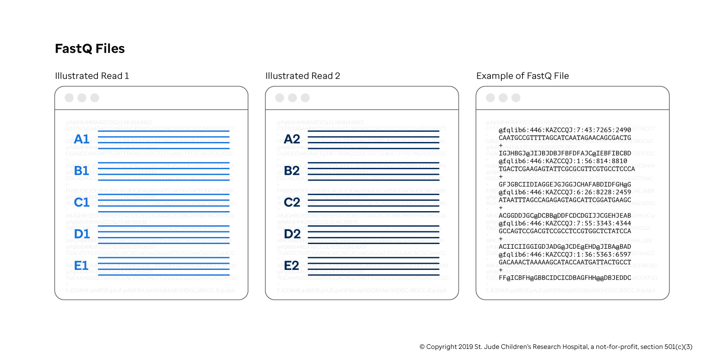
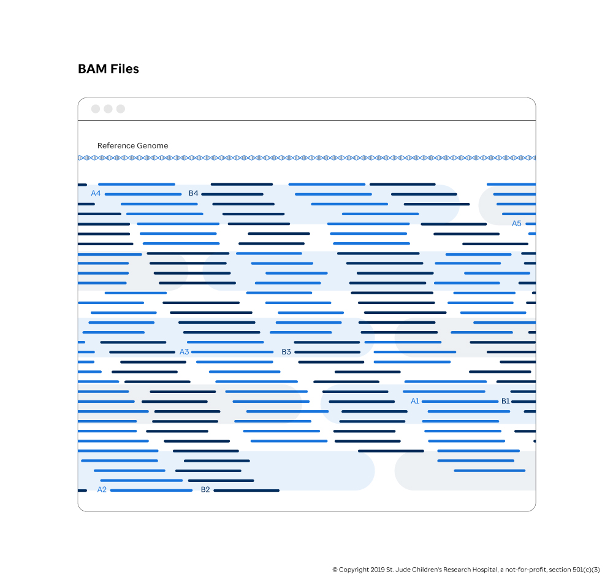

When working with genomics data for the first time, many engineers are surprised to find that genomics file types are quite simple in structure. In fact, a majority of universal file formats such as [SAM/BAM](https://samtools.github.io/hts-specs/SAMv1.pdf), [VCF](https://samtools.github.io/hts-specs/VCFv4.2.pdf), [BED](https://uswest.ensembl.org/info/website/upload/bed.html), [GFF/GTF](https://uswest.ensembl.org/info/website/upload/gff.html) and many other custom formats are simply tab-delimited text files with some form of compression. Mastery of Unix command line tools such as grep, less, cut, join, sort, sed, and awk are essential to working effectively in this domain.

## Compression and BGZF

The BGZF compression technique and associated [bgzip](http://www.htslib.org/doc/bgzip.html)/[tabix](https://www.htslib.org/doc/tabix.html) tools were developed as general purpose utilities to enable random access lookup in compressed tab-delimited text files. By default, the gzip compression algorithm creates a single stream of data---accessing information in the middle of that compressed stream requires decompressing the stream from the beginning. Genomic files tend to be substantial in size, so decompressing an entire file to retrieve information is a waste of time and resources. The BGZF compression technique solves this problem by creating multiple gzip streams as contiguous "blocks" and storing the offsets to each block in an associated **index file**. In this case, you can retrieve a subset of information from the file by seeking past all of the irrelevant BGZF blocks (avoiding the associated computational overhead) and only decompressing the block that contains the information you want.

Consider a single, bgzipped BAM file with the name Sample.bam. This file will typically be accompanied by an index called Sample.bam.bai, which contains offsets to the BGZF blocks. These two files are often treated as a pair.

For more information, see "The BGZF compression format" section in [the SAM file specification](http://samtools.github.io/hts-specs/SAMv1.pdf).

## Comparison with Gzip

Below is a simple comparison of gzip versus bgzip to illustrate the trade-off. Note that while gzip achieves a slight edge in compression ratio, the bgzip/tabix pair is vastly superior in lookup time. This non-linear trade-off between compression and random-access speed is why BGZF is pervasive in the field of computational genomics.


```bash
GENCODE_GTF="ftp://ftp.ebi.ac.uk/pub/databases/gencode/Gencode_human/release_32/gencode.v32.chr_patch_hapl_scaff.annotation.gtf.gz"

curl "$GENCODE_GTF" \                        # Download GTF
  | gunzip \                                 # Decompress
  | grep -v "^#" \                           # Remove header lines
  | sort -k1,1 -k4,4n > gencode.v32.all.gtf  # Sort by chromosome name then genomic start lcocation (numerically)
```

```bash
gzip -c gencode.v32.all.gtf > gencode.v32.all.gtf.gzipped
bgzip -c gencode.v32.all.gtf > gencode.v32.all.gtf.bgzipped

ls -lah
# Permissions Size User    Date Modified Name
# .rw-r--r--  1.4G cmcleod  8 May 23:31  gencode.v32.all.gtf
# .rw-r--r--   61M cmcleod  8 May 23:32  gencode.v32.all.gtf.bgzipped
# .rw-r--r--   48M cmcleod  8 May 23:32  gencode.v32.all.gtf.gzipped
```

```bash
tabix -p gff gencode.v32.all.gtf.gzipped
# [tabix] was bgzip used to compress this file? gencode.v32.all.gtf.gzipped

tabix -p gff gencode.v32.all.gtf.bgzipped
```

```bash
time (zgrep "gene_name=NOTCH1" gencode.v32.all.gtf.gzipped &> /dev/null)

# ( zgrep "gene_name=NOTCH1" gencode.v32.all.gtf.gzipped &> /dev/null; )  20.60s user 0.05s system 99% cpu 20.693 total

time (tabix gencode.v32.all.gtf.bgzipped chr9:136,496,070-136,545,786 &> /dev/null)

# ( tabix gencode.v32.all.gtf.bgzipped chr9:136,496,070-136,545,786 &> /dev/nul)  0.01s user 0.00s system 83% cpu 0.018 total
```

## FASTQ Files

For most workflows in computational genomics, the input files are in the FASTQ format. [The dedicated Wikipedia page](https://en.wikipedia.org/wiki/FASTQ_format) for the FASTQ file is quite good, so we recommend you take a look before starting this section. As a reminder, this guide focuses on Illumina-produced FASTQ files, though the concepts are generally applicable to most sequencers today.

Technically speaking, FASTQ files are not a direct product of sequencers as many have their own intermediate representation of the reads (e.g. [BCL files](https://www.illumina.com/informatics/sequencing-data-analysis/sequence-file-formats.html) for Illumina sequencers) that need to be translated into FASTQ files (using a tool like [bcl2fastq](https://support.illumina.com/sequencing/sequencing_software/bcl2fastq-conversion-software.html)). In practice, many sequencing cores do this translation step before sending the data to the computational engineers downstream.

A FASTQ file may come as either a single file or an inseparable pair of files for single-end or paired-end sequencing respectively. A FASTQ file contains many reads, which, as noted before, are fragments of DNA/RNA read by the sequencer. Each read in the file has the following four-line structure separated by newlines.



| **Line Number** | **Line Description**                                                                                                                          |
| --------------- | --------------------------------------------------------------------------------------------------------------------------------------------- |
| 1               | The sequence name, which on modern Illumina sequencers, this is a coordinate system dictating where the read originated from on the flow cell |
| 2               | The sequence of the DNA fragment                                                                                                              |
| 3               | A single + delimiter character, often referred to as the "plus line"                                                                          |
| 4               | The associated quality scores, one per nucleotide coordinating with line 2; generally an ASCII encoded probability score of incorrectness     |

Random access within FASTQ files is not typical, so they are gzipped (not bgzipped) to save space. Conventionally, FASTQ file names indicate which read the files contains (e.g. Sample.fastq.gz for single-end sequencing or Sample_R1.fastq.gz and Sample_R2.fastq.gz in paired-end sequencing where _R1 stands for "read one(s)" and _R2 stands for "read two(s)").

Note that in the case of paired-end sequencing, it is crucial that each of the FASTQ files list their reads in same order. If even one read is deleted from either file, the entire read pairing will be off, which will have disastrous results during the alignment phase. To catch common formatting errors in single-end or paired-end FASTQ files, consider using [fqlib](https://github.com/stjude/fqlib) (specifically, the lint subcommand).

Below is an example of the first four lines of a pair of FASTQ files generated by fq generate and validated by fq lint.

```bash
fq generate --n-records 2 Sample_R1.fastq.gz Sample_R2.fastq.gz
```

```bash
gzip -dc Sample_R1.fastq.gz

# @fqlib5:334:VVDJXFE:4:5:7053:1012/1
# CCTTTTCCCGCAGTCGTCAGCAGTAAGTGTGCGACCGGTAGTTCAAAAGGGGAATATCACCCGCTATTTTGCGAATACTAGAGCCTCGGTTCACGCAAGCA
# +
# GFGDDB@CJCHDBDBDB@JACCIE@J@GD@FHFADAIEA@@ABBEADHBFH@CIEFBBHGCHEJHEAIHAAIHBGEH@EDGAEEC@FGEABAHE@FAI@IC
# @fqlib5:334:VVDJXFE:7:33:2310:7985/1
# ACGTGGCCGTCCTTTTGCCAGATATCGGTAAGAGAGTTCTAGCTAAGATAATATCAATCCGCGAATGTCAGAGGGAGTGTTTCCCTTCCGGGGAAGCAAAT
# +
# GDGE@DBJJCBHCGFEBHDGEI@JA@GHEHA@CCJGCGGDJGBACIBGECDDBGBHI@GBAEBBJD@@BAFBHAHEHJCBGFGCA@GJ@IAAIJDHG@IDC

gzip -dc Sample_R2.fastq.gz

# @fqlib5:334:VVDJXFE:4:5:7053:1012/2
# ATGCCAATGGGAAGCTCGGGTAGTTCTTTCATCATGGTAATAAATCGACCGAACAACCGTTCAGGGCCAGATGAAAAGGGCCTGGCGTCTGGCACAGACCC
# +
# FGDFEHBCJFDFCFHEHFGEEADCBEF@JJD@HEGE@@AIIIDHGHADEAHA@D@DCAGBFH@HBDGICI@ICAAGJBCDDGEFJ@JBHGJFACEECJEJJ
# @fqlib5:334:VVDJXFE:7:33:2310:7985/2
# GCCCGTAGCAATACTCCTTGCGGGGACGATTATGGCGTTAATCTGATATCTCAAGCAGTAGTGGGGCTATACACTTGCGCCGTAGTCGAGCGGTTTGTAGT
# +
# DIGCJJHDCEDDDAGH@FFGHFEAB@JDA@@HH@AJJIHJCA@JFHGAHA@CCGJDF@BJ@AH@B@BH@JCCEIDCIFCED@E@D@II@HBJIADG@EFDB
```

```bash
fq lint Sample_R1.fastq.gz Sample_R2.fastq.gz

# Exit code is 0, which means all went well.

# Simulate a missing quality score, which would be a malformed file.

zcat Sample_R2.fastq.gz | head -n 7 | gzip -c > Sample_R2.bad.fastq.gz

fq lint Sample_R1.fastq.gz Sample_R2.bad.fastq.gz

# Sample_R2.bad.fastq.gz:8:1: [S004] CompleteValidator: Incomplete record: quality is empty
```

## BAM Files

The **Sequence Alignment/Map** (or SAM) format is the most common output file format after the read alignment. Typically, these files will be encoded in a binary format, bgzipped, indexed, at which point the file is referred to as a Binary Alignment/Map Format or BAM file. Each BAM file contains a header (typically used for storing metadata) followed by millions of reads, stored as one read per line. Each read contains all of the information available in the FASTQ file (read name, sequence, associated quality score), as well as additional information added by the aligner, including where the read maps to the reference genome, whether the read was produced by PCR or optical duplication, and the quality of the alignment assigned by the mapping software.

Ultimately, a SAM file is a tab-delimited text file that could be piped into standard Unix tools for processing. BAM files can be treated in much the same way if passed through samtools view first. Learn more about it in the associated [documentation](https://samtools.github.io/hts-specs/SAMv1.pdf).



## VCF Files

The **Variant Call Format** (or VCF) is the most common format for storing variants detected in next-generation sequencing data. Typically, these files will be bgzipped and indexed. Each VCF file contains a header (typically used for storing metadata) and a list of variants. Minimally, each variant contains information about the where the variant lives in the genome and a definition of the change caused by the variant. It also supports storing information about the cohort samples and which samples contain which variants (effectively a [num_variants] X [num_samples] matrix with information on every sample, variant pair.)

Concretely, the minimal VCF looks like this.

| **CHROM** | **POS**   | **ID**     | **REF** | **ALT** | **QUAL** | **FILTER** | **INFO** |
| --------- | --------- | ---------- | ------- | ------- | -------- | ---------- | -------- |
| chr1      | 114713908 | rs11554290 | T       | A       | .        | .          |
| chr17     | 7683718   | .          | C       | CT      | .        | .          |

These fields describe:

- **Variant Location.** Typically, the chromosome, position, reference base(s), and alternative base(s) fields are used to create an "address" of the variant in the genome using the form chrom-pos-ref-alt.

- **Variant Identifier.** The ID field is used to store one or more unique identifiers for the variant. Commonly, the rs numbers from [dbSNP](https://www.ncbi.nlm.nih.gov/snp/) are used.

- **Quality of the Variant.** A measure of confidence in the called variant or lack thereof. This field follows the common practice of encoding qualities as a Phred-scaled quality score with the formula . A score of 10 means there is a 1 in 10 chance of the call being incorrect, 20 means a 1 in 100 chance of the call being incorrect, and so on. If unknown, the value should be the missing value, a period.

- **Filter Status.** This denotes the status of whether the variant passed all quality filters from the caller. If the variant passes, the value will have a value of PASS. If the variant fails any filters, the value will be a semi-colon separated list of codes for the filters. If unknown, the value should be the missing value.

- **Additional Information.** A field which can contain an arbitrary number of key-value pairs separated by semicolons of the form /<key/>=/<value1/>[,/<value2/>]. While there are some reserved keys specified in the documentation, anything can be denoted here. If there is no additional information, this field is empty.

As alluded to earlier, the VCF format is flexible in that it *may* specify one or more samples and indicate whether the sample contains any of the variants specified in the file. A simplified version of this would be something like:

**Chromosome** **Position** **ID** **REF** **ALT** **Sample1** **Sample2** **Sample3**

---

chr1 114713908 rs11554290 T A YES NO NO
chr17 7683718 . C CT NO YES YES

However, in practice this is complicated by the fact that variants can have various genotypes (homozygous reference allele, homozygous alternate allele, or heterozygous) and evidence depth. For more information, see the "Genotype fields" section of the [VCF specification](https://samtools.github.io/hts-specs/VCFv4.2.pdf).

Ultimately, a VCF file is just a tab-delimited text file that could be piped into standard Unix tools for processing. Learn more about it [here](https://samtools.github.io/hts-specs/VCFv4.3.pdf).
