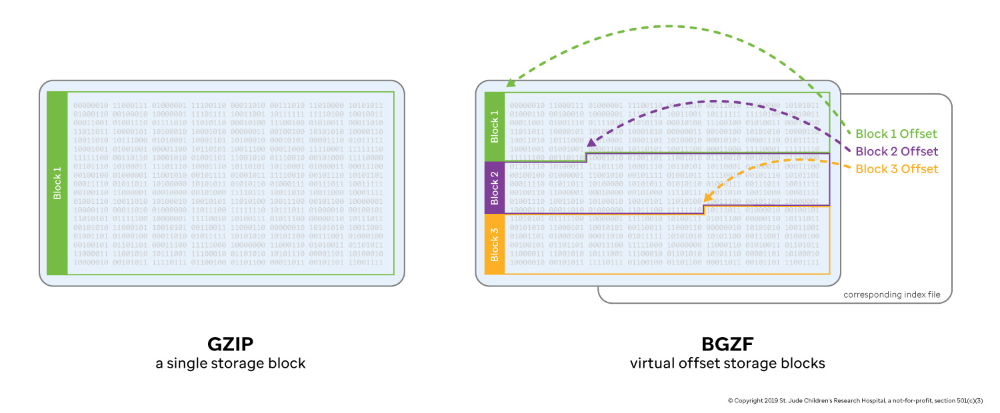

# Compression and BGZF

The BGZF compression technique and associated [bgzip](http://www.htslib.org/doc/bgzip.html)/[tabix](https://www.htslib.org/doc/tabix.html) tools were developed as general purpose utilities to enable random access lookup in compressed tab-delimited text files. By default, the gzip compression algorithm creates a single stream of data---accessing information in the middle of that compressed stream requires decompressing the stream from the beginning. Genomic files tend to be substantial in size, so decompressing an entire file to retrieve information is a waste of time and resources. The BGZF compression technique solves this problem by creating multiple gzip streams as contiguous "blocks" and storing the offsets to each block in an associated **index file**. In this case, you can retrieve a subset of information from the file by seeking past all of the irrelevant BGZF blocks (avoiding the associated computational overhead) and only decompressing the block that contains the information you want.

Consider a single, bgzipped BAM file with the name Sample.bam. This file will typically be accompanied by an index called Sample.bam.bai, which contains offsets to the BGZF blocks. These two files are often treated as a pair.

For more information, see "The BGZF compression format" section in [the SAM file specification](http://samtools.github.io/hts-specs/SAMv1.pdf).

## Comparison with Gzip

Below is a simple comparison of gzip versus bgzip to illustrate the trade-off. Note that while gzip achieves a slight edge in compression ratio, the bgzip/tabix pair is vastly superior in lookup time. This non-linear trade-off between compression and random-access speed is why BGZF is pervasive in the field of computational genomics.



```bash
GENCODE_GTF="ftp://ftp.ebi.ac.uk/pub/databases/gencode/Gencode_human/release_32/gencode.v32.chr_patch_hapl_scaff.annotation.gtf.gz"

curl "$GENCODE_GTF" \                        # Download GTF
  | gunzip \                                 # Decompress
  | grep -v "^#" \                           # Remove header lines
  | sort -k1,1 -k4,4n > gencode.v32.all.gtf  # Sort by chromosome name then genomic start lcocation (numerically)
```

```bash
gzip -c gencode.v32.all.gtf > gencode.v32.all.gtf.gzipped
bgzip -c gencode.v32.all.gtf > gencode.v32.all.gtf.bgzipped

ls -lah
# Permissions Size User    Date Modified Name
# .rw-r--r--  1.4G cmcleod  8 May 23:31  gencode.v32.all.gtf
# .rw-r--r--   61M cmcleod  8 May 23:32  gencode.v32.all.gtf.bgzipped
# .rw-r--r--   48M cmcleod  8 May 23:32  gencode.v32.all.gtf.gzipped
```

```bash
tabix -p gff gencode.v32.all.gtf.gzipped
# [tabix] was bgzip used to compress this file? gencode.v32.all.gtf.gzipped

tabix -p gff gencode.v32.all.gtf.bgzipped
```

```bash
time (zgrep "gene_name=NOTCH1" gencode.v32.all.gtf.gzipped &> /dev/null)

# ( zgrep "gene_name=NOTCH1" gencode.v32.all.gtf.gzipped &> /dev/null; )  20.60s user 0.05s system 99% cpu 20.693 total

time (tabix gencode.v32.all.gtf.bgzipped chr9:136,496,070-136,545,786 &> /dev/null)

# ( tabix gencode.v32.all.gtf.bgzipped chr9:136,496,070-136,545,786 &> /dev/nul)  0.01s user 0.00s system 83% cpu 0.018 total
```